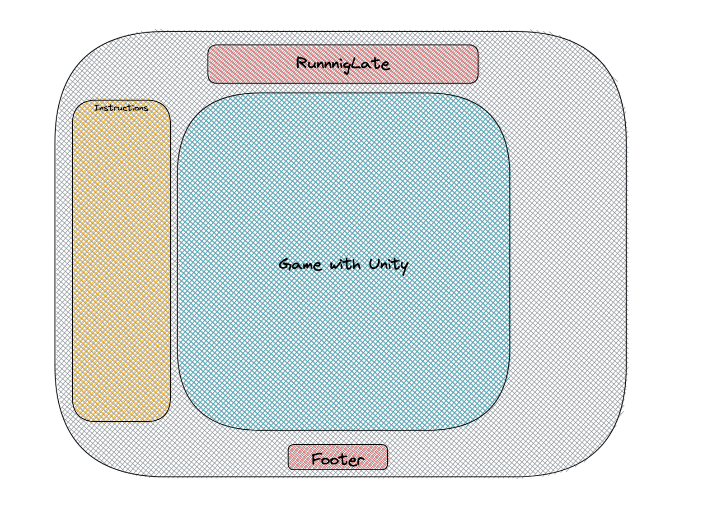
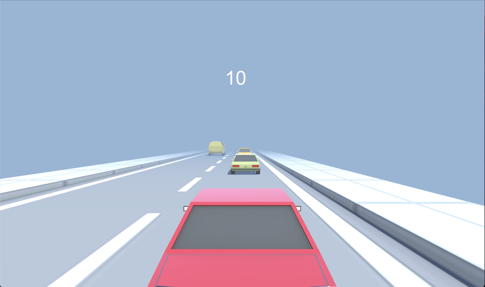

# RunningLate

## Description of Game
This is a simple racing game using "awsd" or the arrow keys to move a car rushing through traffic. This game will keep score based on time you have lasted. There is no certain winner but a highscore.

---
## Technologies

The technologies used in this app are Unity game engine and C#.

    
---
## General Approach
* The approach I took on this project was first to get comfortable with unity by learning off of tutorials and documentation.

* After getting comfortable with unity and coding a little with C# I started to think of game idea and wanted to do something simple but also fun to play.

* After I thought of a game to make I started by making game objects in unity and like the ground and the player. 

* I adjusted the transform component to what I wanted for each object then gave the player a rigidbody component which would allow for the Unity physics to be applied to it. 

* Once I applied the physics rigidbody component I add a script to it which allowed me to add forces to the player object.

* Once I figured out the forced that were needed for the player object I then did it for the obstacles. 

* I also had to add a script to the camera to allow it to follow the car while it speeds foward.

* Then I added a Unity canvas which allows for text to appear on the screen and I made a script that would allow it to track the change in postion of the object. 

---
## Code Highlights
Player Movement Script
``` c# 
using UnityEngine;

public class PlayerMovement : MonoBehaviour {
    // make public variables so that we could use them on the engine.
    public Rigidbody player;

    public float forwardForce = 2000f;

    public float sidewaysForce = 60f;

    // Update is called once per frame
    void FixedUpdate() {
        // Applying forward force to the player
        // using "Time.deltaTime" to make the speed of the player equal for player that have a lower frame-rate
        player.AddForce(0, 0, forwardForce * Time.deltaTime); 
        // allow the user to moce the player left and right with a, d, left arrow, and right arrow
        if (Input.GetKey("right") || Input.GetKey("d")) {
            player.AddForce(sidewaysForce * Time.deltaTime, 0, 0, ForceMode.VelocityChange);
        }
        if (Input.GetKey("left") || Input.GetKey("a")) {
            player.AddForce(-sidewaysForce * Time.deltaTime, 0, 0, ForceMode.VelocityChange);
        }
        // here we are calling an object called the gameManager so that we could end the game and restart.
        if (player.position.y < -1f) {
            FindObjectOfType<GameManager>().EndGame();
        }
    }
}

```
Player Collision Script
``` C# 
using UnityEngine;

public class PlayerCollision : MonoBehaviour {
    public PlayerMovement movement;

    void OnCollisionEnter (Collision collisionInfo) {
        // Debug.Log(collisionInfo.collider.tag)
       if (collisionInfo.collider.tag == "Obstacle") {
           // stops movement of player
            movement.enabled = false; 
            // we use this since if we were to use a variable then there would be an instance of a player in unity for the game manager script to reference.
            // so we call it when its needed -- like this... 
            FindObjectOfType<GameManager>().EndGame();
       }

    }
}
```

## Wireframes


---
## Picture of the Game


---
## User Stories
As a user I want to be able to play a functioning game that will allow me to move my car left and right to dodge obsticles such as moving cars in traffic.

---

## MVP's
Using the Unity Game Engine and C# to have a working functioning 3D game that allows the player to move there car left to right on a plane while dodging obsticles in this case other cars in traffic. 


## Unsolved Problems and Major Hurdles Overcame

* At first I had to learn how to use the game objects to my advatage since I was making a 3d game I had to plan for how Im going to setup the game in a 3d plane. 

* Getting the models for the cars -> I first started making the models my self and I tried 2 different programs. One on my table called Shapr3d but when I made it half way through I realized I needed to export and in order to do that I needed to buy a annual subscription for it. I then tried to use an app on my Mac called Blender but it started bugging out for me. So i did more research on models in Unity and came across the Unity Project Manager where they have free models for developers to use. 

* being able to commit my work from VSCode to GitHub, once I made the Unity project and put it in my project folder it did not allow me to upload to GitHub since there were like 126 files need to be uploaded. It wasn't until I finshed my game that I researched it and found that with Unity there is a .gitignore file that I needed with about 72 lines of ignore files needed in it.

* An Unsolved problem was deployment of the app as of now I can only use play the game locally since I wasn't able to find a way to add the game file onto a react app since I used C# instead of javascript. 
